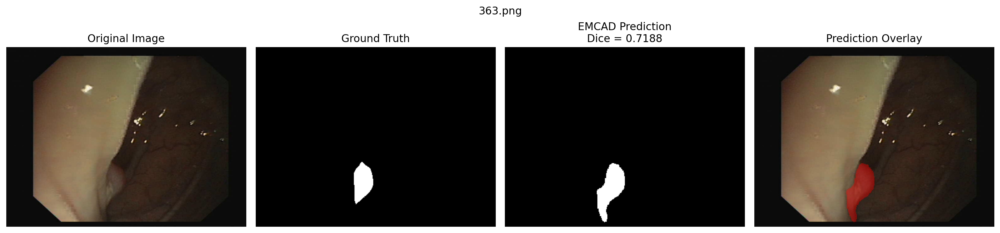
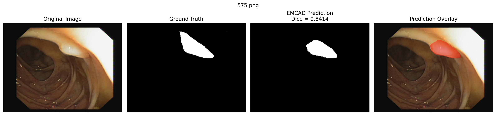
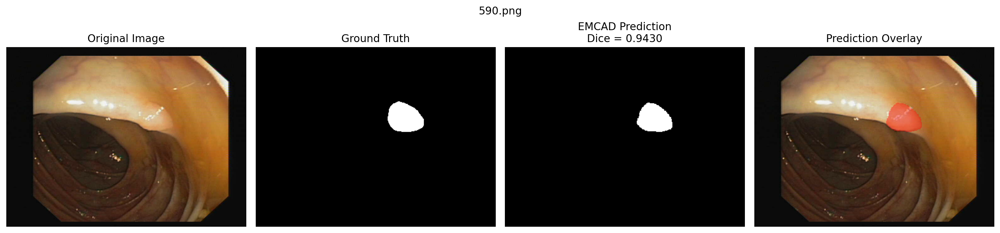
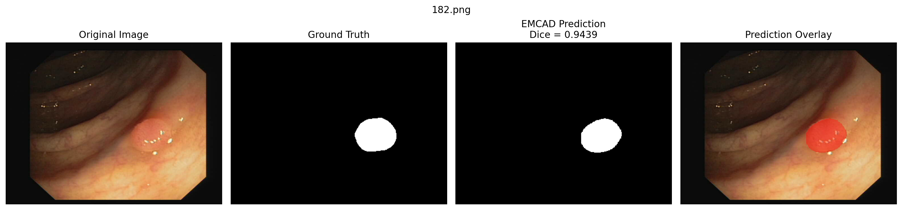
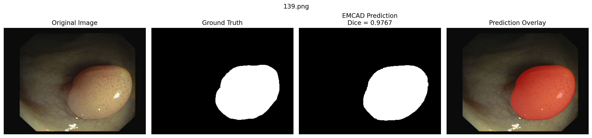
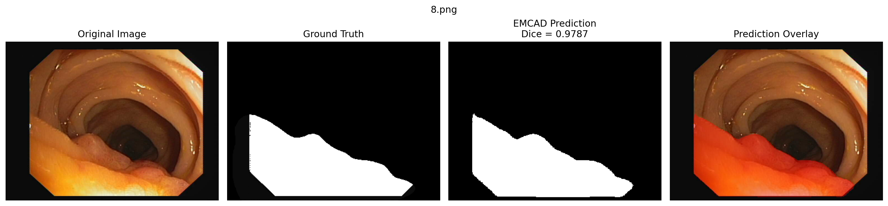

# EMCAD on ClinicDB: Independent Experimental Reproduction
Independent experimental reproduction of PVT-EMCAD-B2 (CVPR 2024) on ClinicDB — 95.02% Dice vs. 95.21% reported.


[](https://openaccess.thecvf.com/content/CVPR2024/html/Rahman_EMCAD_Efficient_Multi-scale_Convolutional_Attention_Decoding_for_Medical_Image_Segmentation_CVPR_2024_paper.html)
[](https://github.com/SLDGroup/EMCAD)


Independent experimental reproduction and analysis of:

> **EMCAD: Efficient Multi-scale Convolutional Attention Decoding for Medical Image Segmentation**  
> Md Mostafijur Rahman, Mustafa Munir, and Radu Marculescu  
> *Proceedings of the IEEE/CVF Conference on Computer Vision and Pattern Recognition (CVPR), 2024*

**Paper:**  
https://openaccess.thecvf.com/content/CVPR2024/html/Rahman_EMCAD_Efficient_Multi-scale_Convolutional_Attention_Decoding_for_Medical_Image_Segmentation_CVPR_2024_paper.html

**Official implementation:**  
https://github.com/SLDGroup/EMCAD

This project independently reproduces the **PVT-EMCAD-B2** segmentation
pipeline on **ClinicDB** using the authors' publicly released EMCAD
implementation.

The goal was not simply to execute the repository, but to independently
configure the experimental pipeline, train the model in a different
computational environment, select the checkpoint using validation
performance, perform standalone test evaluation, and compare the resulting
performance with the published benchmark.

---

## 🔬 Reproduction Result

| Metric | Published EMCAD | My Reproduction |
|---|---:|---:|
| Model | PVT-EMCAD-B2 | PVT-EMCAD-B2 |
| Dataset | ClinicDB | ClinicDB |
| Input resolution | 352 × 352 | 352 × 352 |
| Training epochs | 200 | 200 |
| Batch size | 16 | 4 |
| GPU | RTX A6000 48 GB | Tesla T4 |
| Runs | 5-run average | 1 run |
| **Dice** | **95.21%** | **95.02%** |

**Difference: 0.19 percentage points**

The reproduced result closely approaches the published ClinicDB benchmark
despite differences in hardware, software environment, batch size, and
number of runs.

> **Important:** This is an implementation-based reproduction under
> different computational conditions, not an exact reproduction of the
> authors' original experimental environment.

---

## 📊 Final Test Performance

The best checkpoint was selected using validation Dice and then reloaded
for a separate evaluation over the complete 62-image ClinicDB test split.

| Metric | Result |
|---|---:|
| **Dice** | **0.950151 (95.02%)** |
| IoU | 0.907202 |
| Sensitivity | 0.954845 |
| Specificity | 0.996946 |
| Precision | 0.948724 |
| HD95 | 8.108 |
| Test images | 62 |

**Best epoch:** 160  
**Best validation Dice:** 0.936713

---

## 🧠 What is EMCAD?

EMCAD is an efficient multi-scale convolutional attention decoder designed
for medical image segmentation.

The architecture combines:

- **MSCAM — Multi-Scale Convolutional Attention Module**
  - Channel Attention Block (CAB)
  - Spatial Attention Block (SAB)
  - Multi-Scale Convolution Block (MSCB)

- **LGAG — Large-Kernel Grouped Attention Gate**
  - Efficiently fuses decoder and skip-connection features.

- **EUCB — Efficient Up-Convolution Block**
  - Uses depth-wise convolution for computationally efficient upsampling.

A central design idea is the use of **parallel multi-scale depth-wise
convolutions**, allowing the decoder to capture spatial information at
multiple receptive-field scales while keeping computational cost low.

For architectural details, please refer to the
[original EMCAD paper](https://openaccess.thecvf.com/content/CVPR2024/html/Rahman_EMCAD_Efficient_Multi-scale_Convolutional_Attention_Decoding_for_Medical_Image_Segmentation_CVPR_2024_paper.html)
and the
[official EMCAD implementation](https://github.com/SLDGroup/EMCAD).

---

## ⚙️ Experimental Environment

| Component | Configuration |
|---|---|
| Platform | Kaggle |
| GPU | NVIDIA Tesla T4 |
| Framework | PyTorch 2.10.0+cu128 |
| CUDA | Enabled |
| timm | 1.0.26 |
| Encoder | PVTv2-B2 |
| Encoder initialization | ImageNet pretrained |
| Decoder | EMCAD |
| Input resolution | 352 × 352 |
| Batch size | 4 |
| Optimizer | AdamW |
| Weight decay | 1 × 10⁻⁴ |
| Maximum epochs | 200 |
| Gradient clipping | 0.5 |
| Multi-scale kernels | [1, 3, 5] |

The batch size was reduced from 16 to 4 because the reproduction was
performed on a Tesla T4 rather than the 48 GB RTX A6000 used in the
original experiments.

---

## 📈 Training and Checkpoint Selection

Training was performed for 200 epochs.

The highest validation Dice occurred at:

- **Epoch:** 160
- **Validation Dice:** 0.936713

The epoch-160 checkpoint was therefore selected rather than the final
epoch.

The selected checkpoint was subsequently reloaded and evaluated
independently on all 62 test images.

This standalone evaluation produced the final reproduction Dice of
**0.950151**.

---

## 🔍 Qualitative Analysis

The reproduction also examined predictions across different levels of
segmentation difficulty.

### Challenging Examples

| Image | Dice |
|---|---:|
| 363.png | 0.7188 |
| 575.png | 0.8414 |

These examples show larger boundary and shape disagreement between the
prediction and ground-truth segmentation.

### Representative High-Performing Examples

| Image | Dice |
|---|---:|
| 590.png | 0.9430 |
| 182.png | 0.9439 |
| 139.png | 0.9767 |
| 8.png | 0.9787 |

These cases demonstrate close agreement between the EMCAD prediction and
the annotated polyp region.

---

## 🖼️ Qualitative Results

### Challenging Case — Dice 0.7188



### Challenging Case — Dice 0.8414



### Representative Case — Dice 0.9430



### Representative Case — Dice 0.9439



### High-Agreement Case — Dice 0.9767



### High-Agreement Case — Dice 0.9787



---

## 🧪 Reproduction Workflow

```text
Official EMCAD codebase
          ↓
Environment configuration
          ↓
PVTv2-B2 + EMCAD initialization
          ↓
ImageNet-pretrained encoder
          ↓
ClinicDB preprocessing
          ↓
200-epoch training
          ↓
Validation-based checkpoint selection
          ↓
Reload best checkpoint
          ↓
Standalone 62-image test evaluation
          ↓
Published vs. reproduced benchmark comparison
          ↓
Quantitative + qualitative error analysis
